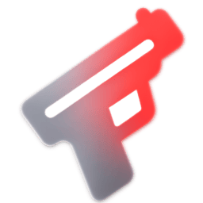

<div align="center">
  

# Nightcord

**A custom Discord client built for people who actually care about how Discord runs.**

[](./LICENSE)
[](https://github.com/o9ll/nightcord)

---

</div>

Nightcord is a fork of Equicord, which itself builds on top of Vencord. We stripped out the obfuscation, cleaned things up, added our own improvements, and kept what works. No bloat, no nonsense.

---

## What's in it

* **Faster startup** — no obfuscation means the client loads noticeably quicker and sits lighter on your CPU and RAM.
* **Auto-updates** — checks for updates in the background on launch and applies them silently.
* **Plugin support** — compatible with the existing plugin ecosystem. Install community plugins straight from Git links.
* **Better audio** — hardware-optimized voice modules for cleaner, louder audio out of the box.
* **Custom styling** — smoother UI, custom icons, and various quality-of-life improvements.

---

## Installation (Windows)

1. Download **`nightcord-install.ps1`**
2. Right-click → **Run with PowerShell**
3. Follow the steps, restart Discord, done.

---

## Building from source

### Requirements

* Git
* Node.js (LTS)
* pnpm

```bash
npm install -g pnpm
```

### Clone & Build

```bash
git clone https://github.com/o9ll/nightcord.git
cd nightcord
pnpm install
pnpm build
```

### Inject into Discord

```bash
pnpm inject
```

### Restore stock Discord

```bash
pnpm uninject
```

---

## Repository

Source code:

https://github.com/o9ll/nightcord

---

## Credits

Nightcord wouldn't exist without [Equicord](https://github.com/Equicord/Equicord) and [Vencord](https://github.com/Vendicated/Vencord). A huge chunk of what makes this work comes directly from their projects. We're fully aware of that and genuinely appreciate everything they've built — we're just taking it in a different direction. Big thanks to everyone who's contributed to both.

---

## Disclaimer

*Nightcord is not affiliated with Discord Inc. in any way.*

Using third-party clients is technically against Discord's Terms of Service. Use at your own risk.
